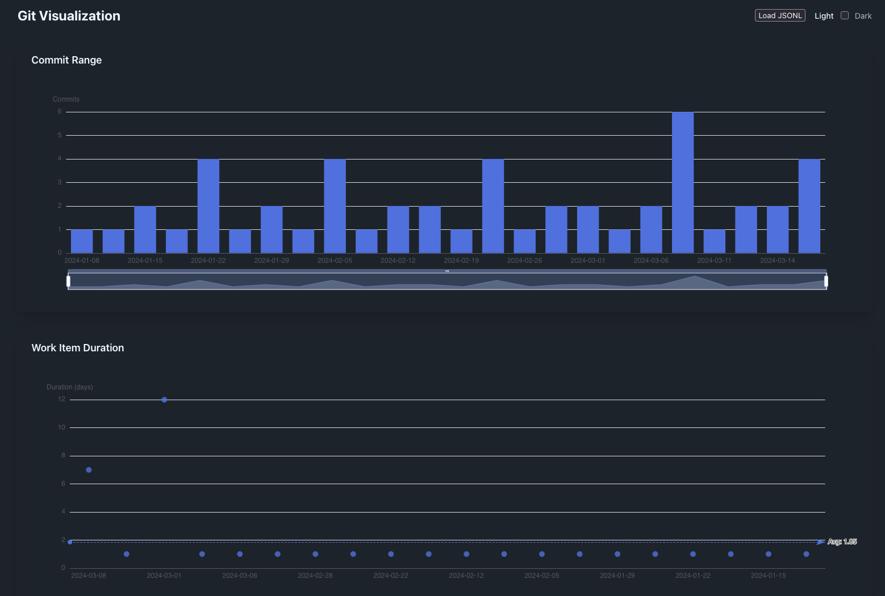

= FlowMiner

A tool for analyzing and visualizing software development flow. Data is mined from git, GitHub issues, Jira etc.

== Structure

* `analysis/` - Data analysis (Kotlin Multiplatform)
* `visualization/` - Data visualization (TypeScript, Lit, Vite)

== Prerequisites

* JDK version from link:.sdkmanrc[] (install via link:https://sdkman.io/[SDKMAN])
** `sdk env install`
* Node.js version from link:.nvmrc[] (install via link:https://github.com/Schniz/fnm[fnm] or link:https://github.com/nvm-sh/nvm[nvm])
** `fnm use --install-if-missing`
* link:https://just.systems[just] command runner

== Usage

. Analyze a git repository to generate a data file:
+
[source,bash]
----
./git-mine.sh /path/to/repo --format jsonl -o project.commits.fm.jsonl
----

. Start the visualization server and open in browser:
+
[source,bash]
----
just dev-viz
----

. Load your generated `.commits.fm.jsonl` file in the visualization

=== Result

This will result in the following visualization:

== Development Commands

=== Build

[source,bash]
----
just build          # Build the project
just dev-viz        # Start dev visualization server
----

=== Test

[source,bash]
----
just test           # Run all tests
just test-analysis  # Run analysis tests
just test-viz       # Run visualization tests
----

=== Subproject Tests

[source,bash]
----
just test-analysis-project <project>      # All tests for subproject
just jvm-test-analysis-project <project>  # JVM tests only
just js-test-analysis-project <project>   # JS tests only
----

Example: `just test-analysis-project analysis:git-importer`
